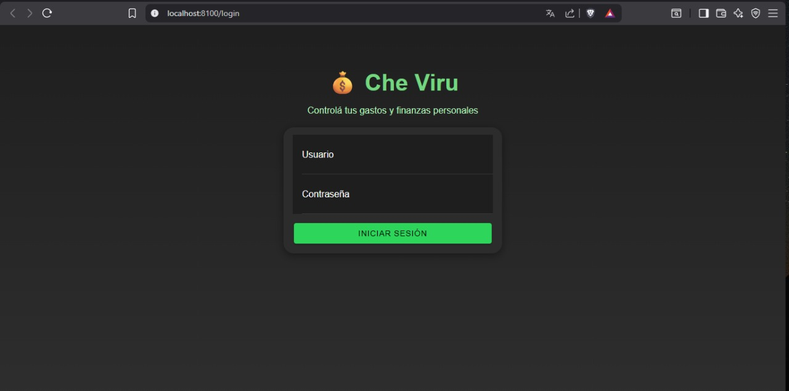
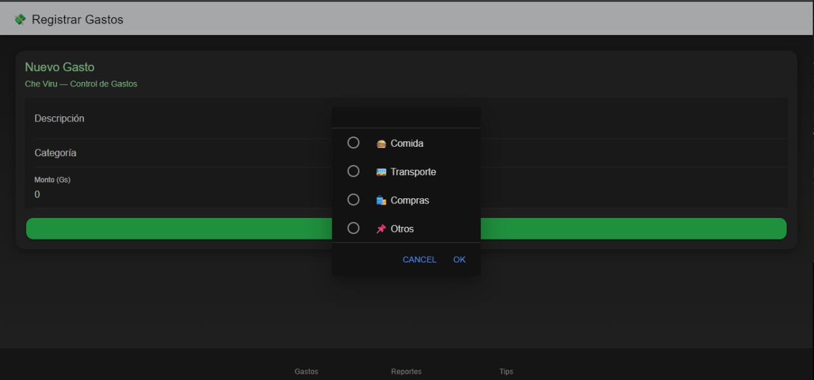
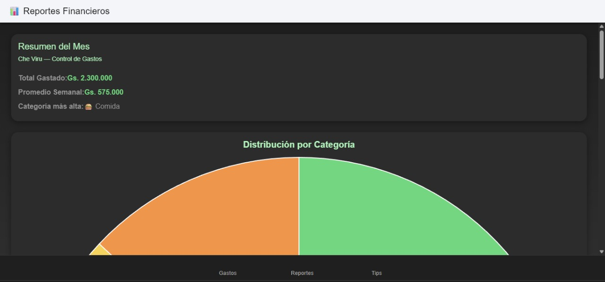
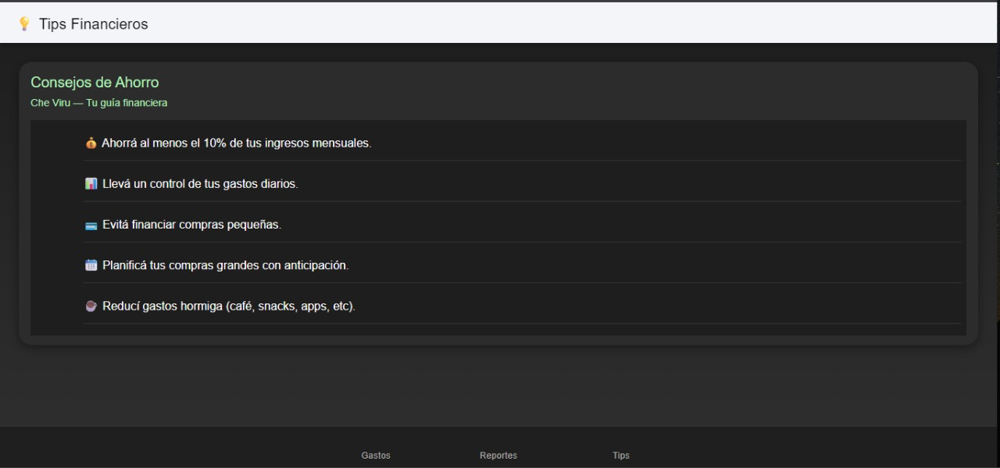

# Che Viru – Aplicación de Control de Gastos

Proyecto desarrollado con **Ionic + Angular (Standalone + Capacitor)** para la materia **Programación VI** de la Universidad del Norte.  
La aplicación permite registrar y visualizar gastos personales, generar reportes gráficos y acceder a consejos financieros orientados a mejorar la administración del dinero.

---

## Descripción General

Che Viru es una aplicación multiplataforma diseñada para ofrecer una interfaz moderna, intuitiva y funcional, donde los usuarios pueden llevar un control de sus gastos semanales o mensuales.  
Incluye un sistema de inicio de sesión, carga de gastos con categorías, visualización mediante gráficos y una sección informativa con tips financieros.

---

## Funcionalidades Principales

**Login**  
Pantalla de inicio de sesión con validación de usuario y contraseña.

**Gastos**  
Permite agregar, listar y eliminar gastos. Cada registro incluye monto, descripción y categoría.

**Reportes**  
Visualiza los gastos mediante gráficos interactivos generados con Chart.js.  
Incluye estadísticas por período y categorías.

**Tips Financieros**  
Muestra consejos útiles sobre ahorro y manejo responsable de finanzas personales.

---

## Tecnologías Utilizadas

| Tecnología | Descripción |
|-------------|-------------|
| Ionic 8 | Framework híbrido para desarrollo móvil y web. |
| Angular 17 | Framework frontend basado en componentes standalone. |
| Capacitor | Integración para compilar la app en plataformas móviles. |
| Chart.js | Librería para generación de gráficos. |
| TypeScript, HTML, CSS | Lenguajes utilizados en la implementación del frontend. |

---

## Capturas del Proyecto

**Pantalla de Login**  

**Página de Gastos**  

**Página de Reportes**  

**Página de Tips Financieros**  

---

## Equipo de Desarrollo

- Edgar Escobar  
- Helen Duré  
- Gabriela Vasso  

**Profesor:** Nuñez Ferreira, Richar José  
**Materia:** Programación VI – Facultad de Ingeniería  
**Universidad del Norte**

---

## Conclusión

El desarrollo del proyecto Che Viru permitió aplicar los conocimientos adquiridos sobre Ionic y Angular, integrando tecnologías modernas para construir una aplicación modular, funcional y visualmente atractiva.  
El trabajo colaborativo entre los integrantes del grupo facilitó la organización, la división de tareas y la obtención de un resultado final sólido y coherente con los objetivos planteados.
